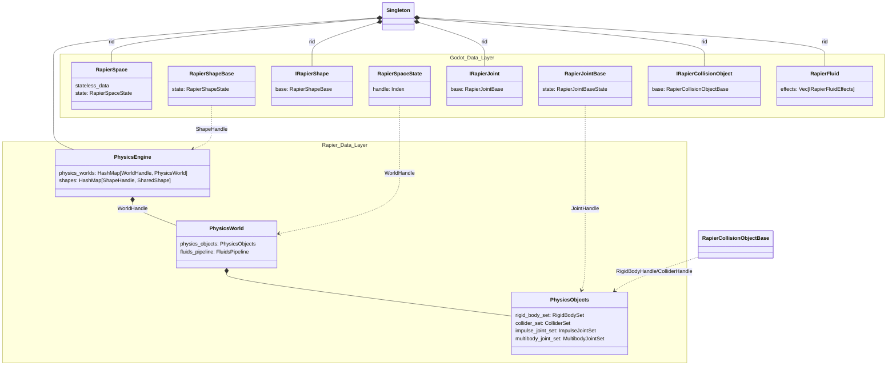

# 00 -- 架构概览 (Architecture Overview)

## 双层架构

Godot Rapier 插件的数据组织分为两层：

- **Godot 数据层 (Godot Data Layer)**：映射 Godot 向插件发送的数据。
- **Rapier 数据层 (Rapier Data Layer)**：从 Godot 数据转换而来，匹配 Rapier 库的数据格式。

两层之间通过一个 **Singleton** 连接，所有对象通过 `Rid` (Resource ID) 进行查找。采用 Singleton 模式的主要原因是 **性能** -- 避免频繁的堆分配和指针追逐。

## Singleton 核心结构

Singleton 维护五组映射关系：

```
HashMap<Rid, RapierSpace>           -- 空间 (物理世界)
HashMap<Rid, RapierCollisionObject> -- 碰撞对象 (Body/Area)
HashMap<Rid, RapierShape>           -- 碰撞形状 (Shape)
HashMap<Rid, RapierJoint>           -- 关节 (Joint)
HashMap<Rid, RapierFluid>           -- 流体 (Fluid)
```

此外还有一个关键的逆向映射：

```
HashMap<Index, Rid>                 -- 从 Rapier 内部句柄反查 Godot Rid
```

以及全局物理引擎实例：

```
PhysicsEngine                       -- 管理所有 PhysicsWorld 和 SharedShape
```

### 为什么需要 Rid -> Object 映射？

Godot 的 PhysicsServer API 是围绕 `Rid` 设计的。当 Godot 调用 `body_set_state(rid, ...)` 时，插件需要在 O(1) 时间内找到对应的 `RapierBody` 对象。Singleton 中的 `HashMap` 提供了这种快速查找。

### 为什么需要 Index -> Rid 反向映射？

Rapier 内部使用 `Index` (基于 arena 的 handle) 标识对象。当碰撞回调返回 Rapier 的 collider handle 时，插件需要反向查找到对应的 Godot `Rid`，才能将碰撞事件正确分派给 Godot 的碰撞对象。

## 类层次结构



## 数据流 (Data Flow)

从 Godot 调用到底层 Rapier API 的完整数据流路径：

```
Godot 调用 (PhysicsServer2D API)
  |
  v
servers 层 (RapierPhysicsServer2D)
  |-- 参数校验、从 Singleton 查找对象
  |
  v
rapier_wrapper 层 (PhysicsEngine)
  |-- Godot 参数转换 (坐标、类型、单位)
  |-- 调用 rapier API
  |
  v
Rapier 库 (rapier2d)
  |-- 物理模拟计算
```

### 具体示例：body_set_state(rid, TRANSFORM, new_transform)

1. **servers 层**：通过 `Singleton.collision_objects.get(rid)` 查找碰撞对象
2. **servers 层**：调用 `body.set_state(TRANSFORM, new_transform, ...)`
3. **Godot 数据层**：`RapierBody.set_state()` 将新 transform 存入缓存
4. **rapier_wrapper 层**：`PhysicsEngine.body_set_transform()` 调用 `RigidBody.set_next_kinematic_position()` 或 `RigidBody.set_position()`
5. **Rapier 层**：Rapier 在 `step()` 中使用新位置进行碰撞检测

## 关键子模块

`src/rapier_wrapper/` 目录下的文件结构：

| 文件 | 职责 |
|---|---|
| `body.rs` | 刚体创建、销毁、属性设置 |
| `collider.rs` | 碰撞体创建、材质设置 |
| `joint.rs` | 关节创建、参数修改、销毁 |
| `shape.rs` | 形状创建 (Box/Circle/Capsule/ConvexPolygon/Concave) |
| `fluid.rs` | 流体粒子创建、效果设置 |
| `physics_world.rs` | 物理世界管理、step 执行 |
| `query.rs` | 射线检测、相交查询 |
| `convert.rs` | 坐标/类型转换 |
| `settings.rs` | WorldSettings 和 SimulationSettings |
| `handle.rs` | HandleDouble (流体句柄) 工具函数 |

## 两层的职责分工

| 职责 | Godot 数据层 | Rapier 数据层 |
|---|---|---|
| 数据存储 | 缓存 stateless/stateful 数据 | 持有 Rapier 原生对象 |
| 参数校验 | 类型检查、范围校验 | 无 |
| 坐标转换 | 无 (由 servers 层完成) | 无 (已转换为 Rapier 向量) |
| 脏标记 | 跟踪待更新属性 | 无 |
| 物理模拟 | 无 | 执行 step() |
| 回调分发 | 碰撞事件转发 | 收集碰撞事件 |

## 与其他章节的关系

- [01-body-bridge.md](01-body-bridge.md) -- 深入刚体桥接层
- [02-joint-bridge.md](02-joint-bridge.md) -- 深入关节桥接层
- [03-fluid-bridge.md](03-fluid-bridge.md) -- 深入流体桥接层
- [04-shape-bridge.md](04-shape-bridge.md) -- 深入形状桥接层
